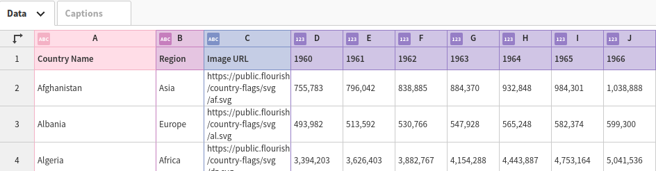
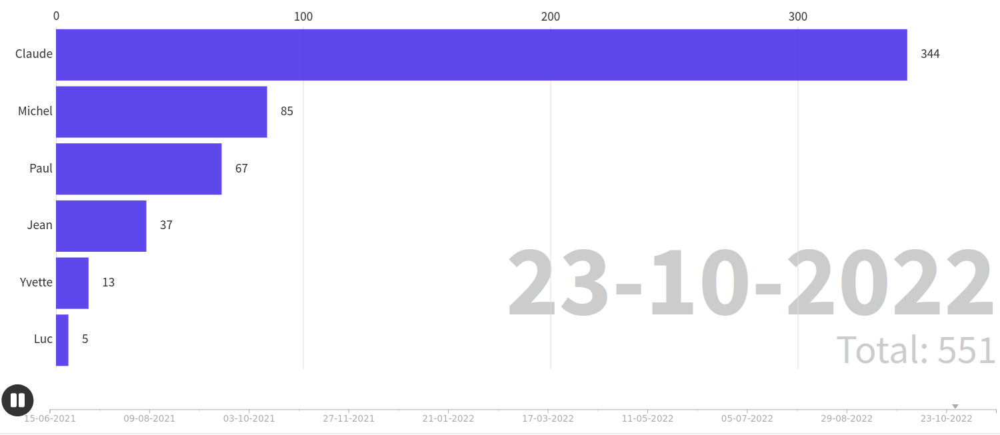
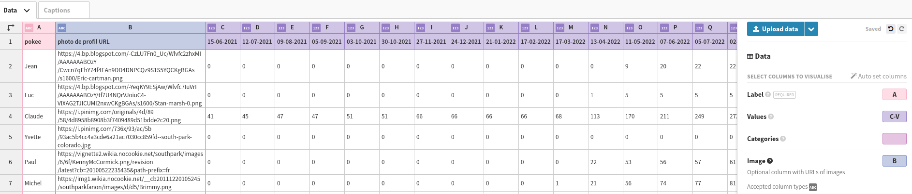
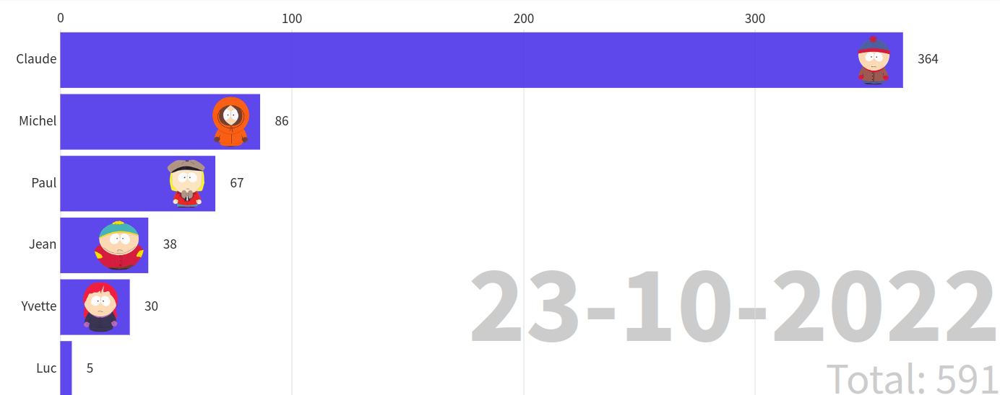

# Poke Race


<!--more-->

Lorsque j'ai récupéré les informations qu'avait Facebook sur moi (voir l'article sur ce que connait Facebook de nous), j'ai trouvé un fichier avec tous les pokes effectués ainsi que le timestamp. Mon colocataire m'a alors donné l'idée de faire une course de diagramme à barres.

C'est donc parti pour ce mini projet personnel.

On commence donc par les données qu'on a :  
On retrouve notre fichier avec `find . -type f -name "poke*"`, il se situe dans `./other_activity/pokes.json`.  
Voici ce qu'il contient :  
{{< style "img { width: 18rem; }" >}}



De l'autre côté, on va utiliser [Flourish](https://flourish.studio/visualisations/bar-chart-race/) pour notre animation.  


On voit que l'on passe d'un format avec le temps de chaque poke, à un format avec le nombre de poke sur un interval donné. Il faut donc traiter les informations. On va faire un peu de python pour aller plus vite.  
Et pour gagner encore plus de temps on va demander à [chatGPT](https://chat.openai.com/chat) de nous aider.  
Après avoir bien arrangé le code, ça donne ça :

```python3
#!/usr/bin/env python3

"""
This code convert the data structure of the pokes.json to
the flourish structure.
"""

from datetime import datetime
import json
import pandas as pd


def process_poke_file(poke_file: str, flourish_file: str, nb_of_intervals=20) -> None:
    """
    Processes a poke.json file and saves the results to a flourish.xlsx file.

    :param flourish_file: The path to the poke.json file to process.
    :param poke_file: The path to the output flourish.xlsx file.
    :param nb_of_intervals:
    """
    # read in json file
    with open(poke_file, encoding='utf-8') as fd:
        data = json.load(fd)

    # create dataframe from json data
    dataframe = pd.DataFrame(data["pokes_v2"], columns=["pokee", "timestamp"])
    print(dataframe)

    # group dataframe by pokee and timestamp intervals
    df_grouped = dataframe.groupby(
        ["pokee",
         pd.cut(dataframe["timestamp"],
                bins=nb_of_intervals)]
    )

    # create pivot table with pokee as columns and timestamp intervals as rows
    df_pivot = df_grouped.size().reset_index().pivot(
        index="pokee", columns="timestamp")
    print(df_pivot)

    # add the previous count each time
    df = df_pivot.cumsum(axis="columns")

    # convert each column of seconds to a date by adding 1970 years.
    df.columns = [f"{datetime.fromtimestamp(int(i.right)).strftime('%d-%m-%Y')}"
                  for (_, i) in df.columns.values]
    print(df)
    df.to_excel(flourish_file)

    print("Done!")


if __name__ == "__main__":
    process_poke_file("pokes.json", "flouriss.xlsx")

```

On ouvre dans Flourish et ça donne ça :  
{{< style "img { width: 20rem; }" >}}



On peut maintenant rajouter des images :  
Pour cela on décale toutes nos données, on modifie le type de la colonne B en "Text" et on vient mettre "B" dans la section "Image".  



[Demo](https://public.flourish.studio/visualisation/12135984/)

Et voilà ! Plus qu'à recommencer avec beaucoup plus de pokes une prochaine fois :)

