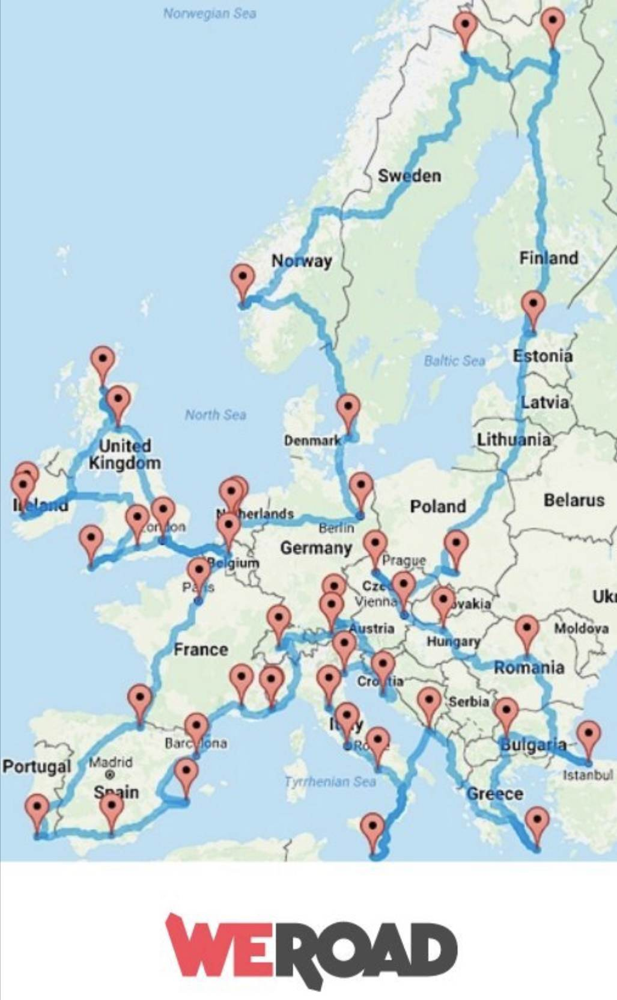

# Préparation d'un grand voyage

<!--more-->

## Europe :  
-> Prendre la carte pour voyager gratuitement dans toute l'Europe en train  
- Finistère  
- Étretat  
- Bretagne 
- Moldavie  
- Bourgogne  
- Nord du portugal  
- Les 5 terres  
- cette carte :

{{< style "img { width: 16rem; }" >}}



## USA :  
- Highway 1 
- Arches  
- Canyonland  
- Yellowstones  

