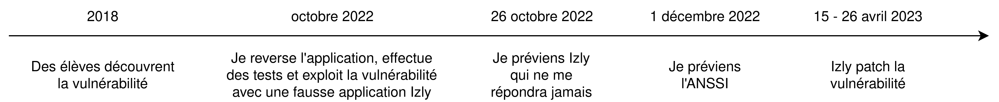
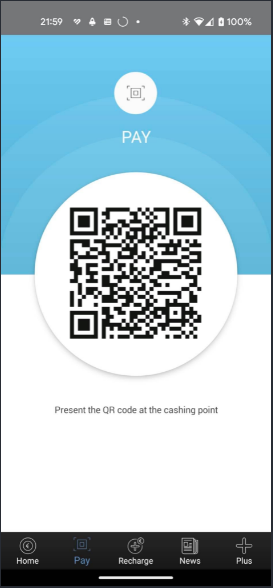
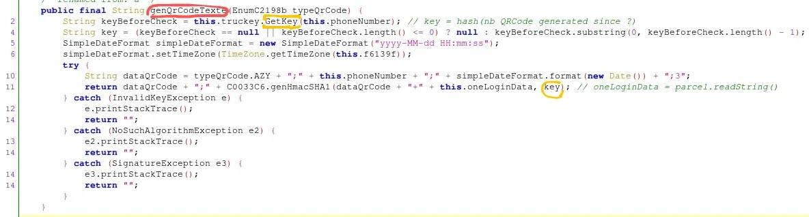
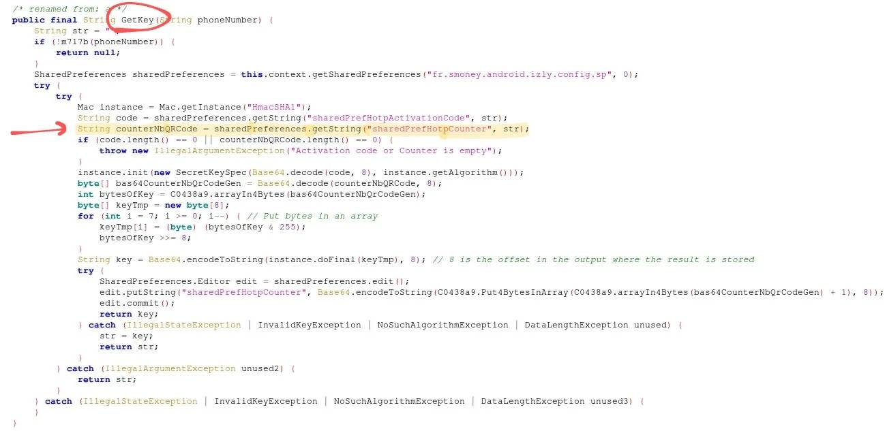
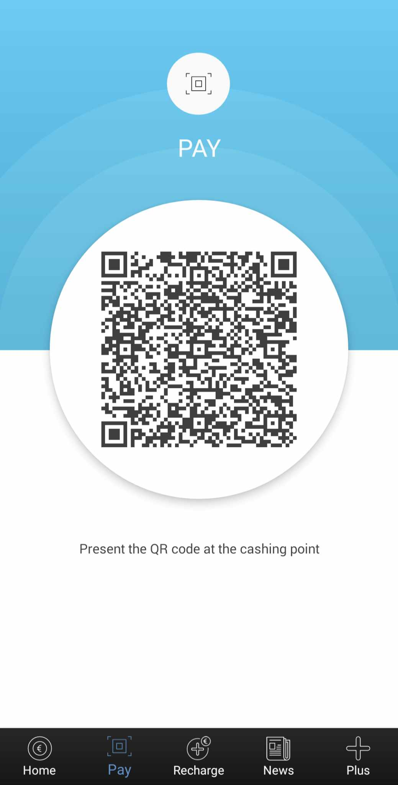

# Vulnerability in the QR Code of the Izly phone application


<!--more-->

## Vulnerability in the QR Code of the Izly phone application

By Clément Gindrier

[**:(fas fa-book fa-fw): PDF version**](paperIzlyTmp.pdf)

### Abstract :

Izly is a smartphone application for paying for meals in university restaurants in France. It is downloaded and used by millions of people.

The paper analyzes a critical vulnerability that I reported, as well as the patch that was applied. This zero-click vulnerability affected all phones, on all versions of the application, and made it possible to break the main functionality of the application without leaving any trace.
It allowed users to have all their meals paid for by other people using only their phone numbers, without them being able to do anything about it.

During my analysis, I was warned that other students had, 4 years earlier, found this vulnerability. This meant that it had been present for at least as long. Although The vulnerability had not been reported by these student.
I reported the vulnerability to the Izly developers on October 26, 2022 with the email: `support.izly@s-money.fr` which appears on the Play Store (no other contact is available on the site). Then, seeing that they didn't reply, I sent a report to ANSSI on December 1, 2022 via the email they gave on their site: `cert-fr@ssi.gouv.fr` with their PGP key, and they replied immediately. The vulnerability was corrected from April 15 to 26, 2023 with a forced update. Izly never contacted me for help or threats, but ANSSI confirmed that it was following my complaint that the application was patched.




<!--### Vulnerability and exploitation-->

<!--An attacker can get someone else to pay for all his university restaurant meals, knowing only the victim's telephone number.-->

<!--Needed for the attacker :-->

<!--- The victim's telephone number  -->

<!--- The victim must have enough money in his Izly account-->
  

<!--The attack is based on the fact that the QR Code generated by the Izly application to pay uses an HMAC as protection, which is never verified by the server. The QR Code is generated offline.-->

<!--This means that the QR Code is not protected, and the text can be modified.-->

<!---->

<!--QR Code text:-->

<!--```cfscript-->
<!--AIZ;                                 -> QR Code type-->
<!--33601234567;                         -> editable phone number-->
<!--2022-11-26 20:11:51;                 -> Date and time of QR Code creation-->
<!--3;                                   -> QR Code type's Number-->
<!--141739b44f3c79e8cdee7896b87b6d46f0a6e042 -> HMAC of previous information-->
<!--```-->

<!--In conclusion, all you need to do is :-->

<!--- Enter the victim's telephone number in the correct format (33 instead of 0 at the beginning).-->
  
<!--- Set the time at which you will pay (UTC+0), as the QR Code expires in a few minutes.-->
  
<!--- Set any HMAC, as it will not be checked. You can even leave it out.-->
  

<!--Then generate the QR Code, pass it in front of the scanner like a normal Izly QR Code, and the person with that number will pay.-->

<!--The attack can be automated with an application that has the same interface as Izly's, for greater discretion.-->

<!--### Vulnerability impact-->

<!--Victim:-->

<!--- Cannot protect herself against the attacks except by removing her money from the application and stopping using the application-->
  
<!--- She can only see the payment history to realize that she has lost money-->
  

<!--The attacker:-->

<!--- He cannot be tracked, since no information about him is sent.-->
  
<!--- He can't be caught in the act, since at the checkout, only the victim's balance appears in addition to the receipt. No one can guess that he's not paying for himself.-->
  
<!--- The attack works without any action on the part of the victim.-->
  
<!--- All he needs is a telephone number containing money on the Izly account. He can try several numbers to see the remaining balance at the cash register.-->
  
<!--- Anyone can use the vulnerability in a matter of seconds, without any computer knowledge-->
  

<!--The vulnerability therefore seems critical.-->

<!--Personally I don't know any victims or people who have complained about it. Although Izly hasn't communicated on it. So I don't know the real impact this vulnerability has had.-->

<!--### Proof of Concept:-->

<!--I cannot do a demonstration here (although I've done it before in university restaurants), but I can prove the bug with the code of the APK.-->

<!--#### Application code:-->

<!--The application's decompiled code with Jadx shows that the HMAC is generated with a key based on the number of QR Code creations by the user. However, we can generate QR Codes offline, and therefore locally, without any communication with the server. The server cannot therefore be aware of the key, and therefore of the hash. The information is therefore unprotected, as it cannot be verified by the server.-->

<!---->

<!--Here we see that the HMAC key `key` line 11 is generated in the `Getkey` function line 2.-->

<!---->

<!--We can see in the `GetKey` function that the `sharedPreferences` "sharedPrefHotpCounter" is retrieved, and will then be transformed a little to make it the key.-->

<!---->

<!--The `sharedPreferences` "sheredPrefHotpCounter" is initialized to 0 here, then incremented by 1 each time a QR Code is created (in the function that generates the HMAC key).-->

<!---->

<!--These are the only places where this `sharedPreferences` is modified.-->

<!--#### Tests :-->

<!--It's possible to modify the hash, and even all the QR Code information as long as you remain consistent with the format, then regenerate the QR Code and see that it's still possible to pay. In this way, you can generate the entire QR Code with any number without needing the Izly application.-->

<!--So I automated the process on a new Kotlin application with the same interface, choosing from my contacts who would pay.-->

<!--### Patch-->

<!--As of April 15, 2023, a forced update of Izly has been released fixing the vulnerability.  -->
<!--QR Code text :-->

<!---->

<!--```cfscript-->
<!--AIZ; 										-> QR Code type-->
<!--a87f7661-7be9-4381-a423-67c238bb3dde; 		-> UUID-->
<!--2023-07-08 15:58:24; 						-> Code creation date and time-->
<!--3; 											-> Code type number-->
<!--73d9c0958d315640c90292c6e92f05920552d307;	-> HmacSHA1 not checked-->

<!--MEYCIQCcLB40kgofoTlawlX7RX4eMOig/dTrfJYdl   -> Signature SHA256 with ECDSA-->
<!--iJQpUSJEgIhAIfYfs0ovSErPdGloQ7gI61kG/atwV-->
<!--sjmckX5hr+Uq5M							-->
<!--```-->

<!--2 lines have changed:-->
<!--- the telephone number that identified the customer has been replaced by a version 4 UUID, i.e. a random number. -->
<!--- A new SHA256 signature with ECDSA has been added to guarantee data integrity.-->

<!--#### Reproduce the exploit-->

<!--To reproduce the exploit, we now need to know the victim's UUID and private key.-->
<!--We can verify this by modifying the application used to exploit the previous vulnerability. -->
<!--We recover our private key using the Frida tool, then reimplement the signature as Izly does, to obtain a valid QR Code again, according to openssl.-->

<!--```java-->
<!--public java.lang.String signature(@org.jetbrains.annotations.NotNull java.lang.String textToSign,-->
                                  <!--org.jetbrains.annotations.NotNull java.lang.String key) {-->
    <!--java.security.PrivateKey privateKey -->
        <!--= java.security.KeyFactory.getInstance("EC", new org.spongycastle.jce-->
          <!--.provider.BouncyCastleProvider())-->
          <!--.generatePrivate(-->
            <!--new java.security.spec.PKCS8EncodedKeySpec(-->
            <!--android.util.Base64.decode(key, 0)));-->
    <!--java.security.Signature signature = java.security.Signature.getInstance("SHA256withECDSA");-->
    <!--signature.initSign(privateKey);-->
    <!--byte[] bytes = textToSign.getBytes(p000.C2403pe.utf8);-->
    <!--signature.update(bytes);-->
    <!--java.lang.String encodeToString = android.util.Base64.encodeToString(signature.sign(), 2);-->
    <!--return encodeToString;-->
<!--}-->
<!--```-->

<!--And then we check that the QR Code works by paying with it in a university restaurant. And it works.-->

<!--To retrieve someone's UUID, we could:-->
<!--- Take photo of the QR Code of someone-->
<!--- Hack Izly's database -->

<!--To recover someone's private key, we could:-->
<!--- Have access one time to the account-->
<!--- Hack Izly's database -->

Unless there are other vulnerabilities in private key generation, the patch seems effective.

The patch has also secured other parts of Izly. For example, it was previously possible to access developer API documentation at https://www.izly.com.

### Conclusion

This paper shows that vulnerabilities still exist in simple mechanisms, and that it is sometimes worth testing them.


