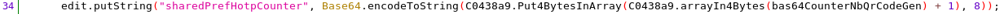

# Vulnérabilité Izly

Rapport vulnérabilité
<!--more-->


## Vulnérabilité dans le QR Code de l'application téléphone Izly

Par Clément Gindrier

### Avant-propos :

Izly est une application pour payer les repas dans les restaurants universitaires     en France. Elle est téléchargée et utilisée par des millions de personnes.

J'ai reporté la vulnérabilité aux développeurs d'Izly le 26 octobre 2022 avec le mail : support.izly@s-money.fr qui apparaît sur le Play Store (aucun autre cZZontact n'est disponible sur le site). Ils n'ont jamais répondu ni résolu la vulnérabilité à la date où j'écris ce rapport.

### Exploitation de la vulnérabilité :

Un attaquant peut faire payer tous ses repas du restaurant universitaire par une autre personne en ne connaissant uniquement le numéro de téléphone de la victime.

Nécessaire pour l'attaquant :

- Numéro de téléphone de la victime
  
- Il faut que la victime ait un compte Izly avec assez d'argent pour payer le repas.
  

L'attaque repose sur le fait que le QR Code généré par l'application Izly pour payer utilise comme protection un HMAC qui n'est jamais vérifié par le serveur. Le QR Code est généré hors ligne.

Ainsi, le QR Code n'est pas protégé, et le texte peut être modifié.

{{< style "img { width: 9rem; }" >}}



Texte du QR Code :

```cfscript
AIZ;                                 -> Type du QR Code
33601234567;                         -> Numéro de téléphone modifiable
2022-11-26 20:11:51;                 -> Date et heure de création du code
3;                                   -> Numéro du type du code
141739b44f3c79e8cdee7896b87b6d46f0a6e042 -> HMAC
```

Il suffit donc :

- Mettre le numéro de téléphone de la victime avec le bon format (33 à la place du 0).
  
- Mettre l'heure à laquelle on va payer (UTC+0), car le QR Code périme en quelques minutes.
  
- Mettre un HMAC aléatoire, il ne sera pas vérifié. On peut même ne pas le mettre.
  

Puis générer le QR Code, le passer devant le scanner comme un QR Code Izly normal, et la personne ayant ce numéro paiera.

L'attaque peut être automatisée avec une application qui aurait la même interface que celle d'Izly pour plus de discrétion.

### Impact de la vulnérabilité

La victime :

- Ne peut pas se protéger contre les attaques à part en enlevant son argent de l'application et en arrêtant d'utiliser l'application
  
- Elle peut uniquement voir l'historique des paiements pour se rendre compte qu'elle a perdu de l'argent
  

L'attaquant :

- Il ne peut pas être traqué puisqu'aucune information sur lui n'est envoyée
  
- Il ne peut pas se faire attraper sur le fait, puisqu'en caisse, seul le solde de la victime apparaît en plus du ticket de caisse. Personne ne peut deviner qu'il ne paie pas pour lui
  
- L'attaque fonctionne sans aucune action de la part de la victime
  
- Il n'a besoin que d'un numéro de téléphone contenant de l'argent sur le compte Izly. Il peut très bien essayer plusieurs numéros pour voir le solde restant à la caisse
  
- N'importe qui peut utiliser la vulnérabilité en quelques secondes, sans aucune connaissance en informatique
  

La vulnérabilité semble donc critique.

### Preuve :

#### Code de l'application :

Le code décompilé de l'application montre que le HMAC est généré avec une clé qui est faite à partir du nombre de créations de QR Code par l'utilisateur. Or, nous pouvons générer des QR Codes hors ligne, et donc en local, sans aucune communication avec le serveur. Le serveur ne peut donc pas être au courant de la clé, et donc du hash. Ainsi, les informations ne sont donc pas protégées car non vérifiables par le serveur.


On voit ici que la clé du HMAC `key` ligne 11 est générée dans la fonction `Genkey` ligne 2.


On voit dans la fonction `GenKey` que la `sharedPreferences` "sharedPrefHotpCounter" est récupérée, et va ensuite être un peu transformer pour en faire la clé.


La `sharedPreferences` "sheredPrefHotpCounter" est initialisée à 0 ici, puis incrémentée de 1 à chaque création de QR Code (dans la fonction qui génère la clé du HMAC).



C'est les seuls endroit où cette `sharedPreferences` est modifiée.

#### Tests :

Il est possible de modifier le hash ainsi que l'heure du texte du QR Code, régénérer le QR Code et voir qu'il est toujours possible de payer. Il est donc très certainement possible de générer entièrement le QR Code avec n'importe quel numéro sans avoir besoin de l'application Izly (Je n'ai essayé qu'avec mon numéro de téléphone, mais tout le monde peut donc le faire avec mon numéro).

### Conclusion :

La vulnérabilité est présente depuis au moins 4 ans, puisqu'elle avait été découverte par 2 étudiants avant moi.

J'aimerais faire corriger la vulnérabilité, et, à défaut, prévenir les étudiants du potentiel danger de perte d'argent en utilisant cette application. Car il me semble assez mauvais de laisser une vulnérabilité en espérant qu'aucune personne malveillante ne tombe dessus.

